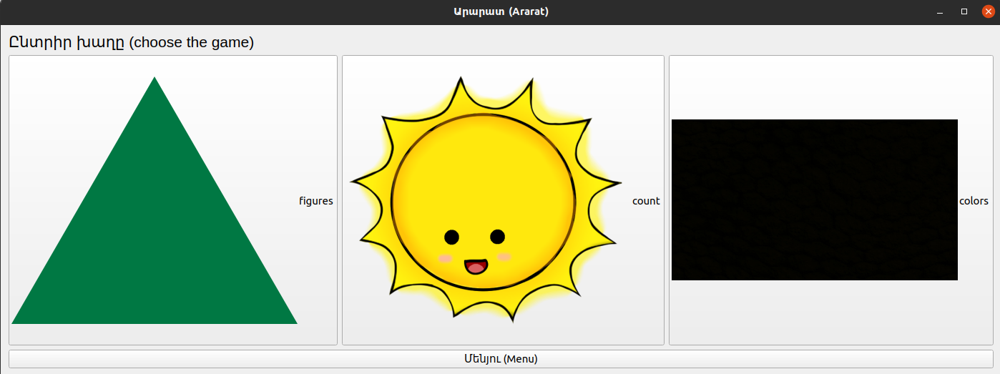
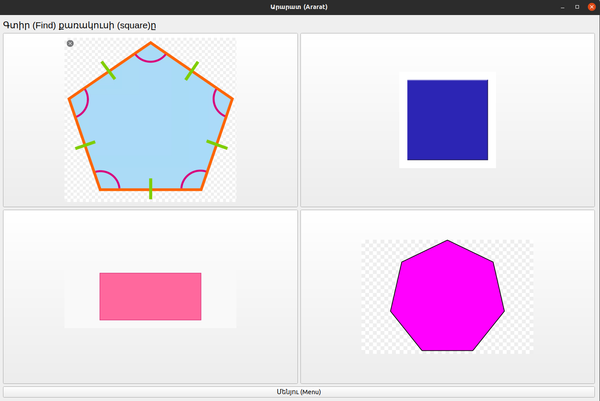
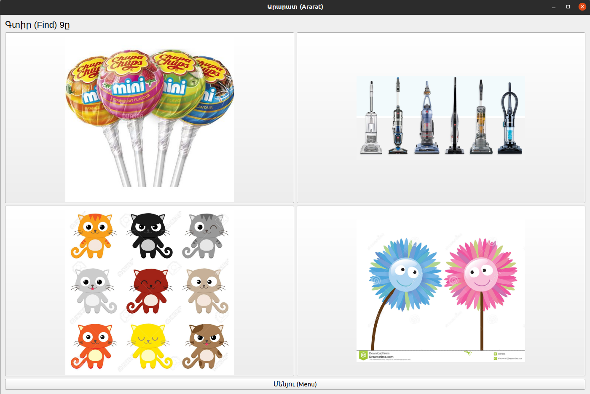
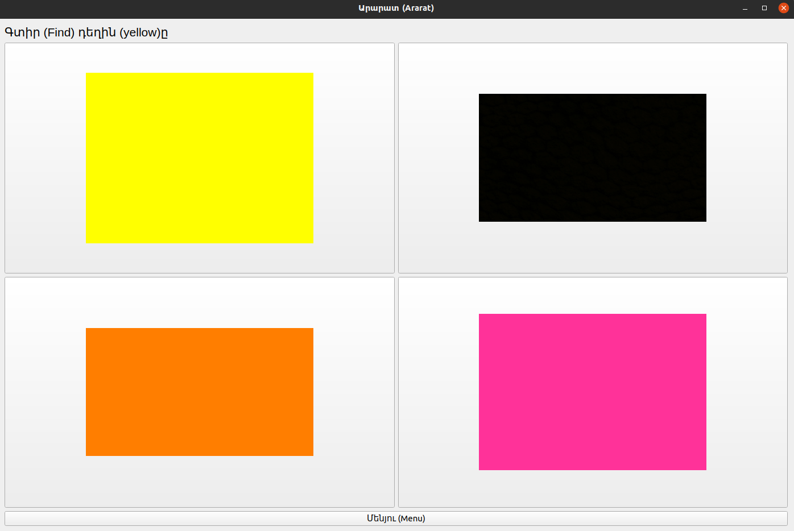

# AraratGame
This game designed for children for learning counting, figures, and colors. It's Only Armenian, but you can easily configure in any language you want. 
The game was written using PyQt5 module
# Installation
```
git clone https://github.com/vardanaloyan/AraratGame.git
cd AraratGame
sudo pip3 install -r requirements.txt
python3 game.py
```

Instructions for Mac M2

```
brew install pyqt5
/opt/homebrew/bin/python3.11 -m pip install playsound -i http://pypi.org --trusted-host pypi.org
/opt/homebrew/bin/python3.11 -m pip install PyObjC -i http://pypi.org --trusted-host pypi.org
/opt/homebrew/bin/python3.11 game.py

```

# Configuration

You can configure your custom game by doing below steps:
  1. create json file in `jsons` directory
    key in json means the object (colorname, figurename, ...)
    value in json means the name of corresponding image
  2. Create directory in `pics` directory with the name of above created json file and put images corresponding to the json file

For questions feel free to contact me (valoyan2@gmail.com)

Below you can see attached screenshots

### Main window

---




### Sub window 1

---




### Sub window 2

---



### Sub window 3

---


